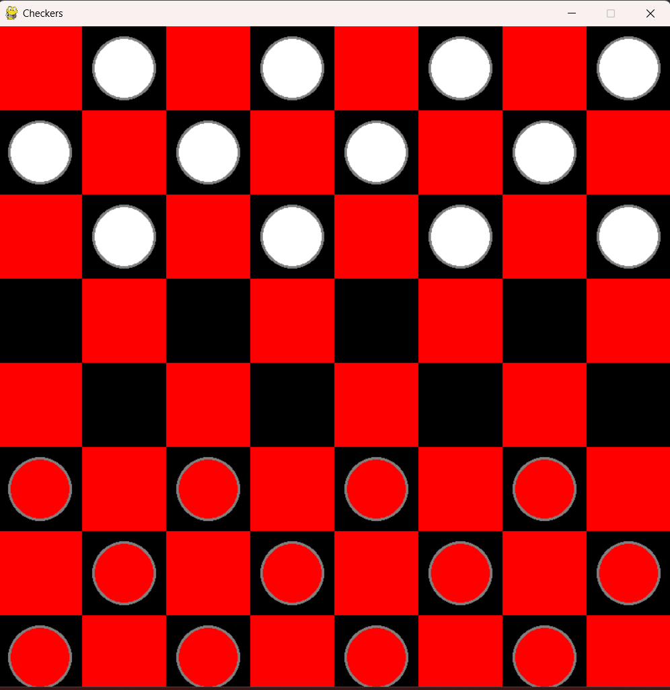
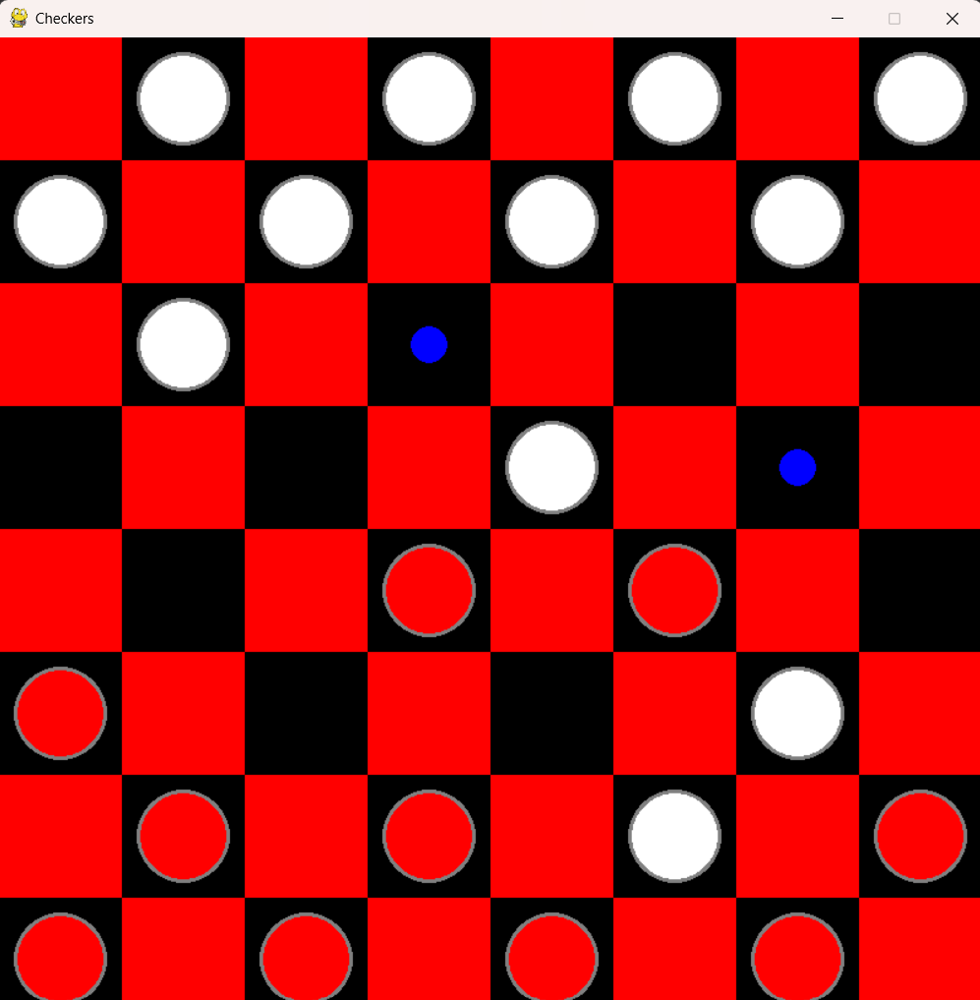

# Checkers

A classic checkers game with an AI opponent powered by the Minimax algorithm.

## Screenshots



<br/>



## How to Play

- Click on a piece to select it
- Click on a highlighted square to move
- Pieces can only move diagonally forward (unless kinged)
- Jump over opponent pieces to capture them
- Reach the opposite side of the board to become a king
- Kings can move in any direction

## Controls

| Action | Method |
|--------|--------|
| Select piece | Left-click on your piece |
| Move piece | Left-click on highlighted square |
| Quit game | Close the window |

## Game Features

- AI opponent using Minimax algorithm with alpha-beta pruning
- Standard checkers rules (8x8 board, 12 pieces per side)
- Kings with crowns and multi-directional movement
- Forced captures (jumps) when available
- Highlighted valid moves for clarity
- Turn-based gameplay

## Installation

1. Make sure you have Python installed (3.6+ recommended)

2. Install pygame:
```bash
pip install pygame
```

3. Make sure you have the `assets` folder with the crown image

4. Run the game:
```bash
python checkers.py
```
## AI Difficulty

The AI uses the Minimax algorithm with:
- Configurable search depth (set in game initialization)
- Evaluation function considering piece count and king advantage
- Both maximizing (AI) and minimizing (player) behavior

## Game Rules

### Movement
- Regular pieces move one square diagonally forward
- Kings move one square diagonally in any direction
- Jumps are mandatory when available

### Capturing
- Jump over an opponent's piece to capture it
- Multiple jumps in one turn are allowed
- Captured pieces are removed from the board

### Winning Conditions
- A player wins when the opponent has no pieces remaining
- A player wins when the opponent has no valid moves

## Asset Credits

Crown icon from [TechWithTim]

## License

[MIT](LICENSE)
